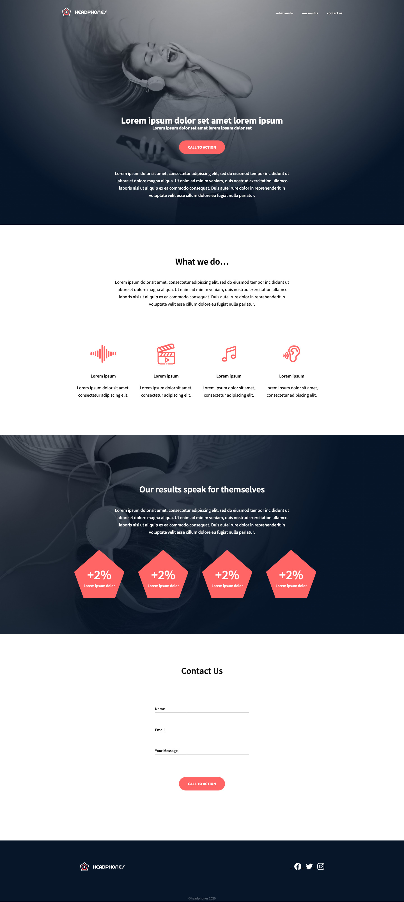
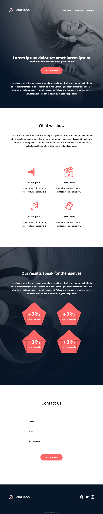

# 0x09. Implement a design from scratch

## Description
In this project a web page is built based on a design made with Figma by Nicolas Philippot, UI/UX designer.
The making of the web page consists of HTML/CSS and it will be both accessible and responsive.

- The web page is developed from scratch, using no libraries or Javascript.
- The webpage switches to a mobile version for devices with a screen width of 140px or less.
- It is both responsive and accessible
- Mainly using flexbox and css variables

## End Product
Here's how the website looks like:

### Desktop

### Mobile

## Made by
* **Sofia Cheung** - [Svcg17](https://github.com/Svcg17)
